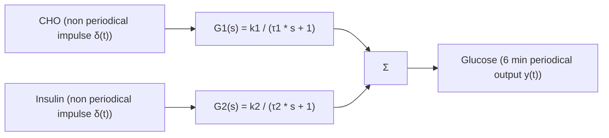

```mermaid
flowchart LR
CHO["CHO (non periodical impulse δ(t))"]
INS["Insulin (non periodical impulse δ(t))"]
G1["G1(s) = k1 / (τ1 * s + 1)"]
G2["G2(s) = k2 / (τ2 * s + 1)"]
SUM["Σ"]
OUT["Glucose (6 min periodical output y(t))"]

CHO --> G1
INS --> G2
G1 --> SUM
G2 --> SUM
SUM --> OUT
```