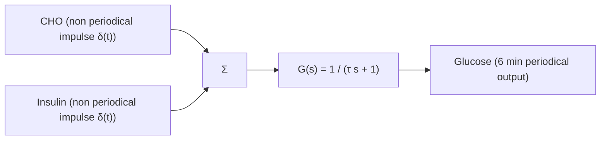

```mermaid
flowchart LR
CHO["CHO (non periodical impulse δ(t))"]
INS["Insulin (non periodical impulse δ(t))"]
SUM["Σ"]
G["G(s) = 1 / (τ s + 1)"]
OUT["Glucose (6 min periodical output)"]

CHO --> SUM
INS --> SUM
SUM --> G
G --> OUT
```