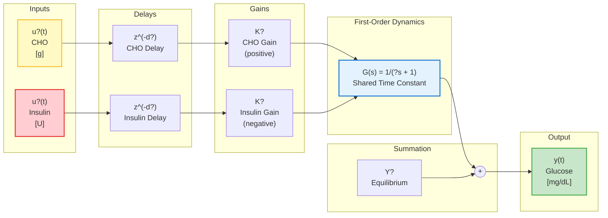

# MIMO First-Order System Identification (Identification3)

## Overview

This document describes the mathematical framework and implementation of **true MIMO first-order system identification** with a single shared time constant for glucose metabolism modeling.

Unlike the two-channel approach (Identification2) which estimates separate dynamics for CHO and insulin, this method enforces a **single shared dynamic response** reflecting the underlying physiology where glucose concentration is governed by one metabolic system responding to multiple inputs.

---

## System Block Diagram



---

## Mathematical Model

### Continuous-Time Representation

The glucose dynamics are modeled as a first-order linear system with two inputs:

$$\tau \cdot \frac{dy(t)}{dt} + y(t) = K_1 \cdot u_1(t - d_1) + K_2 \cdot u_2(t - d_2) + Y_0$$

Where:
- $y(t)$ = Blood glucose concentration [mg/dL]
- $u_1(t)$ = Carbohydrate intake [g] (impulse at meal time)
- $u_2(t)$ = Insulin injection [U] (impulse at injection time)
- $\tau$ = Shared time constant [seconds]
- $K_1$ = Static gain for CHO [mg/dL per g] (expected positive)
- $K_2$ = Static gain for insulin [mg/dL per U] (expected negative)
- $d_1, d_2$ = Transport delays [seconds]
- $Y_0$ = Equilibrium (basal) glucose level [mg/dL]

### Transfer Function Form

In the Laplace domain:

$$Y(s) = \frac{K_1}{\tau s + 1} \cdot U_1(s) \cdot e^{-d_1 s} + \frac{K_2}{\tau s + 1} \cdot U_2(s) \cdot e^{-d_2 s} + \frac{Y_0}{\tau s + 1}$$

Both inputs share the **same first-order dynamics** $G(s) = 1/(\tau s + 1)$, but with:
- Different gains ($K_1$ and $K_2$)
- Different delays ($d_1$ and $d_2$)

### Discrete-Time ARX Model

Using zero-order hold (ZOH) discretization with sampling period $T_s$:

$$y[k] = a \cdot y[k-1] + b_1 \cdot u_1[k-d_1] + b_2 \cdot u_2[k-d_2] + c$$

Where the discrete parameters relate to continuous parameters:

| Discrete | Continuous Relation |
|----------|---------------------|
| $a$ | $a = e^{-T_s/\tau}$ |
| $b_1$ | $b_1 = K_1 \cdot (1 - a)$ |
| $b_2$ | $b_2 = K_2 \cdot (1 - a)$ |
| $c$ | $c = Y_0 \cdot (1 - a)$ |

**Inverse transformations:**

$$\tau = -\frac{T_s}{\ln(a)}$$

$$K_1 = \frac{b_1}{1 - a}, \quad K_2 = \frac{b_2}{1 - a}, \quad Y_0 = \frac{c}{1 - a}$$

---

## Identification Algorithm

### 1. Data Preparation

1. **Load time-series data** for glucose, meals (CHO), and injections (insulin)
2. **Determine common time range** across all signals
3. **Resample to uniform grid** at period $T_s$ (default 900s = 15 min)
   - Glucose: linear interpolation between measurements
   - Inputs: impulse representation (non-zero only at event samples)

### 2. Grid Search Over Delays

For each delay combination $(d_1, d_2)$ in the search space:

- CHO delay: $d_1 \in [1, 12]$ samples (15 min to 3 hours)
- Insulin delay: $d_2 \in [1, 8]$ samples (15 min to 2 hours)

These ranges reflect typical physiological transport delays.

### 3. Ridge Regression

For each delay pair, solve the linear least squares problem:

$$\min_{\theta} \|Y - M\theta\|^2 + \lambda \|\theta\|^2$$

Where:
- $\theta = [a, b_1, b_2, c]^T$ = parameter vector
- $M$ = regression matrix with rows $[y[k-1], u_1[k-d_1], u_2[k-d_2], 1]$
- $Y$ = target vector $[y[k]]$
- $\lambda$ = ridge regularization parameter (default 0.01)

**Solution:**

$$\theta = (M^T M + \lambda I)^{-1} M^T Y$$

### 4. Model Selection

Select the delay combination minimizing the Sum of Squared Errors (SSE):

$$SSE = \sum_{k} (y[k] - \hat{y}[k])^2$$

Where $\hat{y}[k]$ is the one-step-ahead prediction.

### 5. Quality Metrics

| Metric | Formula |
|--------|---------|
| MSE | $MSE = SSE / N$ |
| RMSE | $RMSE = \sqrt{MSE}$ |
| R² | $R^2 = 1 - \frac{SSE}{SST}$, where $SST = \sum_k (y[k] - \bar{y})^2$ |

---

## Physiological Interpretation

### Expected Parameter Values

| Parameter | Typical Range | Interpretation |
|-----------|---------------|----------------|
| $\tau$ | 30-120 min | Glucose metabolic time constant |
| $K_1$ | 0.5-3.0 mg/dL per g | CHO raises glucose |
| $K_2$ | -5 to -20 mg/dL per U | Insulin lowers glucose |
| $Y_0$ | 80-120 mg/dL | Fasting glucose level |
| $d_1$ | 15-60 min | CHO absorption delay |
| $d_2$ | 15-45 min | Insulin action onset delay |

### Physical Meaning

- **Time constant $\tau$**: Represents how quickly glucose returns to equilibrium after a perturbation. Larger $\tau$ means slower response.

- **CHO gain $K_1$**: Steady-state glucose rise per gram of carbohydrate. Depends on carbohydrate type and individual metabolism.

- **Insulin gain $K_2$**: Steady-state glucose reduction per unit of insulin. Reflects insulin sensitivity (negative value expected).

- **Delays $d_1, d_2$**: Account for:
  - Gastric emptying and intestinal absorption (CHO)
  - Subcutaneous absorption and transport (insulin)

---

## Comparison with Identification2

| Aspect | Identification2 (Two-Channel) | Identification3 (True MIMO) |
|--------|-------------------------------|------------------------------|
| Time constants | Separate $\tau_1$, $\tau_2$ | Single shared $\tau$ |
| Model structure | Sum of two SISO systems | True MISO system |
| Data requirement | Isolated segments | All data together |
| Physiological basis | Empirical | More physiologically grounded |
| Complexity | Higher (more parameters) | Lower (fewer parameters) |

---

## Implementation Details

### Code Structure

```
SharedMathematics/
??? Identification3.cs    # True MIMO first-order identification
?   ??? MimoResult        # Result container class
?   ??? IdentifyMimoFirstOrder()  # Main identification method
?   ??? FitMimoGivenDelays()      # Ridge regression solver
?   ??? ComputeMimoSSE()          # Error computation
?   ??? SimulateModel()           # Model simulation

GlucoMan.Maui/
??? IdentificationPage2.xaml      # UI with MIMO button
??? IdentificationPage2.xaml.cs   # btnIdentify3_Click handler
```

### Key Parameters

| Parameter | Default | Description |
|-----------|---------|-------------|
| `TsSeconds` | 900 (15 min) | Sampling period matching CGM |
| `maxDelaySamples` | 40 | Maximum delay search range |
| `ridge` | 0.01 | Regularization strength |

---

## Literature References

### Glucose-Insulin Modeling

1. **Bergman, R.N., et al.** (1981). "Quantitative estimation of insulin sensitivity." *American Journal of Physiology*, 236(6), E667-E677.
   - The "Minimal Model" for glucose-insulin dynamics

2. **Cobelli, C., et al.** (2009). "Diabetes: Models, Signals, and Control." *IEEE Reviews in Biomedical Engineering*, 2, 54-96.
   - Comprehensive review of glucose modeling approaches

3. **Hovorka, R., et al.** (2004). "Nonlinear model predictive control of glucose concentration in subjects with type 1 diabetes." *Physiological Measurement*, 25(4), 905-920.
   - First-order approximations in glucose control

### System Identification

4. **Ljung, L.** (1999). *System Identification: Theory for the User*, 2nd ed. Prentice Hall.
   - Standard reference for ARX models and parameter estimation

5. **Söderström, T. & Stoica, P.** (1989). *System Identification*. Prentice Hall.
   - Ridge regression and regularization in identification

### Delay Estimation

6. **Björck, Å.** (1996). *Numerical Methods for Least Squares Problems*. SIAM.
   - Numerical aspects of delay grid search

---

## Limitations and Future Work

### Current Limitations

1. **Linear model**: Cannot capture saturation or nonlinear insulin sensitivity
2. **First-order dynamics**: May miss higher-order transient behavior
3. **Impulse inputs**: Meals and injections treated as instantaneous
4. **No meal composition**: CHO treated uniformly regardless of glycemic index
5. **No exercise effects**: Physical activity not modeled

### Potential Extensions

1. **Second-order dynamics**: Add additional pole for more accurate transients
2. **Time-varying parameters**: Account for circadian variations
3. **Nonlinear gains**: Model insulin sensitivity as glucose-dependent
4. **Multiple time constants**: Different $\tau$ for CHO and insulin (as in Identification2)
5. **State estimation**: Kalman filtering for real-time prediction

---

## Usage Example

```csharp
// Get data from business layer
var glucose = blGlucose.GetSensorsRecords(dateFrom, dateTo);
var meals = blMeals.GetMeals(dateFrom, dateTo);
var injections = blInj.GetQuickInjections(dateFrom, dateTo);

// Run MIMO identification
var result = Identification3.IdentifyMimoFirstOrder(
    glucose,
    meals,
    injections,
    TsSeconds: 900.0,      // 15 min sampling
    maxDelaySamples: 40,   // Up to 10 hours delay
    ridge: 0.01);          // Regularization

// Access results
Console.WriteLine($"Time constant: {result.Tau / 60:F1} min");
Console.WriteLine($"CHO gain: {result.K1:G3} mg/dL per g");
Console.WriteLine($"Insulin gain: {result.K2:G3} mg/dL per U");
Console.WriteLine($"R²: {result.RSquared:F3}");
```
