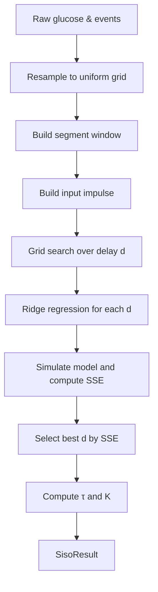

Mathematical methods used in `Identification2`

This document summarizes the mathematical methods used in the `Identification2` class to
estimate parameters of first-order dynamic models from event-based glucose and input data.

1. Overview
-----------
- The code works with timestamped sparse time series (events). These series are resampled on a
  uniform grid using linear interpolation (see `ResampleLinear` in `Identification`).
- Identification is performed on short data segments isolated around an input event (meal or injection).

2. Segment selection (isolation)
--------------------------------
- Before attempting identification on an event, the algorithm performs checks on the left (before)
  and right (after) sides of the event:
  - LEFT (before the event): check that the glucose signal is flat enough over `basalCheckHours`.
    The slope is estimated with OLS and Theil–Sen (robust). A representative slope and a small
    total change condition are required.
  - LEFT: verify there are no "opposite" events in the previous `beforeIsolationHours` (e.g. when
    selecting a meal, there must be no insulin injections in that window). Same-type events are allowed.
  - RIGHT (after the event): verify there are no opposite events within `isolationHours` after the event.
- If the checks pass and there are at least `requiredSamples` (computed from `minDataHours` and sampling
  interval `TsSeconds`), the segment is accepted for identification.

Timeline diagram

```mermaid
gantt	title Segment isolation timeline
    dateFormat	HH:mm
    axisFormat	%H:%M
    section Windows
    beforeIsolation :a1, 00:00, 02:00
    basalCheck     :after a1, 02:00, 02:00
    event          :milestone, m1, after a1, 0min
    isolationAfter :after m1, 03:00, 03:00
```

(Interpretation: the `beforeIsolation` block is the interval before the event where opposite events are disallowed; within it there is the `basalCheck` interval used to assess flatness. `isolationAfter` is the post-event window where opposite events are disallowed.)

3. Single-segment SISO model
----------------------------
- Each accepted segment is modelled with a discrete first-order ARX form:

  y[k] = a * y[k-1] + b * u[k - d] + c + e[k]

  where `a` is the discrete pole, `b` is the discrete input gain, `c` is the offset, and `d`
  is an integer delay (samples). The input `u` is represented as an impulse placed at the
  sample corresponding to the event time.

4. Parameter estimation for a fixed delay
----------------------------------------
- For a fixed integer delay `d`, parameters (a, b, c) are estimated by ridge-regularized
  least-squares: build regressors M with columns [y_{k-1}, u_{k-d}, 1] and solve

    (M^T M + λ I) x = M^T Y,

  where λ is the ridge parameter.
- Rows with NaN in regressors or in the target y are skipped before forming M/Y.

5. Delay search (grid search)
-----------------------------
- A grid search over integer delays in [0..maxDelaySamples] is performed. For each candidate
  delay the (a,b,c) parameters are estimated and the SSE of the simulated model is computed.
- The delay minimizing SSE is chosen (simple exhaustive/grid search). This greedy search is
  repeated iteratively for each input when there are multiple inputs (MISO case) to refine delays.

6. Quality metrics and conversion to continuous parameters
---------------------------------------------------------
- From the best fit we compute SSE, MSE = SSE / N, RMSE, and R^2.
- Convert discrete pole `a` to continuous time constant `τ` (seconds):

    a = exp(-Ts / τ)  =>  τ = -Ts / ln(a)

  if `a` ≤ 0 or `a` ≥ 1, `τ` is considered infinite.
- Convert discrete gain `b` to steady-state (static) gain `K` for the first-order block:

    K = b / (1 - a)

7. Identification for two separate dynamics (CHO and Insulin)
-------------------------------------------------------------
- The process above is applied to each isolated segment (CHO segments and Insulin segments).
- Each segment returns a SisoResult (a,b,c,Delay,SSE,...). Results from many segments are aggregated
  per input type into `AggregatedResult` with mean/std/median statistics for τ, K, delay and offset,
  and average quality metrics.

8. Robustness and pre-processing details
----------------------------------------
- Sensor data are noisy: before slope estimation we apply a light smoothing (3-point moving average)
  to reduce sensor noise.
- Two slope estimators are used:
  - OLS slope from linear regression (sensitive to outliers),
  - Theil–Sen estimator (median of pairwise slopes), robust to outliers.
  The algorithm picks a representative slope and also checks that the total change over the window
  is small compared to a threshold derived from `maxBasalSlope`.
- Rows with NaNs are ignored in regression. The ridge parameter stabilizes inversion when M^T M is ill-conditioned.

9. Numeric examples
-------------------
Example A — slope and flatness test

- Suppose `checkHoursBefore` = 2.0 h and `maxBasalSlope` = 5.0 mg/dL per hour.
- Sampled glucose (mg/dL) at times (hours from window start):

    t = [0.0, 0.25, 0.5, 0.75, 1.0, 1.25, 1.5, 1.75]
    y = [100, 101, 100, 99, 100, 100, 101, 100]

  OLS slope ≈ (small, e.g. 0.1 mg/dL/h), Theil–Sen slope = 0.0, totalChange = |100-100| = 0.
  Both slope and total change are within thresholds -> segment passes basal stability.

Example B — discrete→continuous conversion

- Suppose we estimate `a = 0.98` with `Ts = 900 s` (15 min).
  τ = -Ts / ln(a) = -900 / ln(0.98) ≈ -900 / (-0.0202027) ≈ 44,554 s ≈ 742.6 min ≈ 12.4 h.
  If `b = 0.5`, then static gain K = b / (1 - a) = 0.5 / 0.02 = 25 (units: mg/dL per input unit).

Example C — SSE computation sketch

- Given y (measured) and ySim (simulated), SSE = Σ (y[k] - ySim[k])^2 over valid k.
  If y = [100, 102, 105], ySim = [100.5, 101.8, 104.0], SSE ≈ ( -0.5)^2 + (0.2)^2 + (1.0)^2 = 0.25 + 0.04 + 1.0 = 1.29.

10. Diagrams
------------

Data flow for identification (single segment)

11. Tunable parameters summary
------------------------------
- `TsSeconds`: sampling period used for resampling (e.g., 900 for 15 minutes)
- `basalCheckHours`: hours before event used to test flatness (default 2.0)
- `maxBasalSlope`: slope threshold (mg/dL per hour) for flatness test (default 5.0)
- `beforeIsolationHours`: no-opposite-events window before event (default 2.0)
- `isolationHours`: no-opposite-events window after event (default 4.0 or configurable)
- `minDataHours`: minimum duration of data after event required for identification
- `maxDelaySamples`: maximum delay (samples) to search in grid
- `ridge`: ridge regularization parameter for numeric stability

12. Suggestions for improvement
-------------------------------
- Use more advanced filters on CGM (e.g. low-pass, wavelet denoising) before slope estimation.
- Consider continuous delay estimation (e.g. sub-sample delay) or include delay as continuous
  parameter in nonlinear optimization rather than integer grid search.
- Add confidence intervals for parameters (bootstrap or Bayesian approaches).

---

If you want I can add one worked numerical example end-to-end (generate synthetic input, simulate
first-order responses, add noise, and run the identification showing the recovered parameters).
